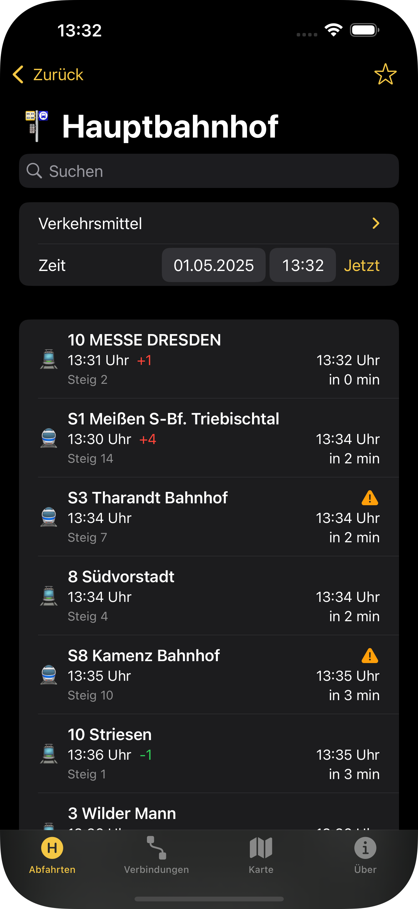

# Haltestellenmonitor-v3
Haltestellen Navigator für Dresden

### Showcase
<p align="center">
  
  
  
</p>

## Anforderungen
* iOS: 16.4
* Xcode 14.3*

Für mehr Infos siehe: https://developer.apple.com/support/xcode/

## How to contribute
0. Erstell ein Issue mit deinem Vorsachlag
1. Fork das Projekt
2. Setzte deinen Vorschlag um
3. Erstelle eine Pullrequest
4. Warte bis ein Maintainer diese annimmt oder Feedback gibt

Bitte achte darauf das neuer Code zum Codestyle des bisher vorhandenen Codes ähnlich ist und verständlich geschrieben ist. 

### Allgemiene Anmerkungen dazu 
* Keine binary Files wie z.B. .DS_Store Datein oder so pushen. 
* Keine Identifier vom z.B. dem Development Team des projektes in Pr ändern
* Bei Fragen wegen Codestyle: [siehe hier](https://google.github.io/swift/)

## How to Install and Run the Project
```
git clone https://github.com/HanashiDev/Haltestellenmonitor-v3
```

Öffne die workspace Datei in Xcode
Nutze CMD + R um das App Shema (Haltestellenmonitor1-DD) auszuführen c:


## License
Das Projekt läuft unter der GNU GENERAL PUBLIC LICENSE. [Für mehr Info siehe hier](/LICENCES.md)